<p align="center">
  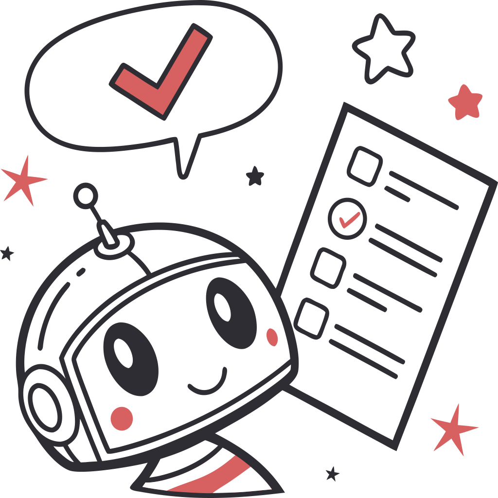
</p>

<h1 align="center">Feedback Bot til Studerende</h1>

<p align="center">
  <a href="README.en.md">English</a>
</p>

<p align="center">
  <a href="LICENSE"></a>
  
  
  
</p>

<p align="center">
  En dansk AI-drevet feedback-chatbot til elever i 7.-9. klasse, der giver formativ vejledning i skolearbejde uden at give direkte svar.
</p>

<p align="center">
  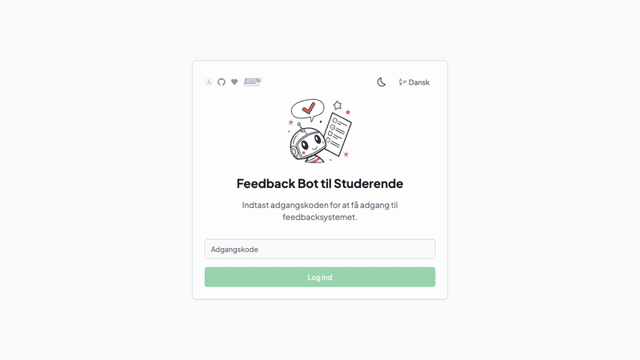
</p>

---

## Sådan virker det

1. **Godkendelse** → Adgangskodebeskyttet session
2. **Onboarding** → Eleven vælger fag, klassetrin og uploader opgave/arbejde
3. **Chat** → Streaming AI-feedback via konfigurerbar LLM-backend

Systemprompt'en, der definerer bottens pædagogiske adfærd, findes i [`src/config/systemPrompt.ts`](src/config/systemPrompt.ts).

## Skærmbilleder

<details open>
<summary>☀️ Lys tilstand</summary>

|                          Adgangskode                          |                       Velkomst                       |
| :-----------------------------------------------------------: | :--------------------------------------------------: |
| [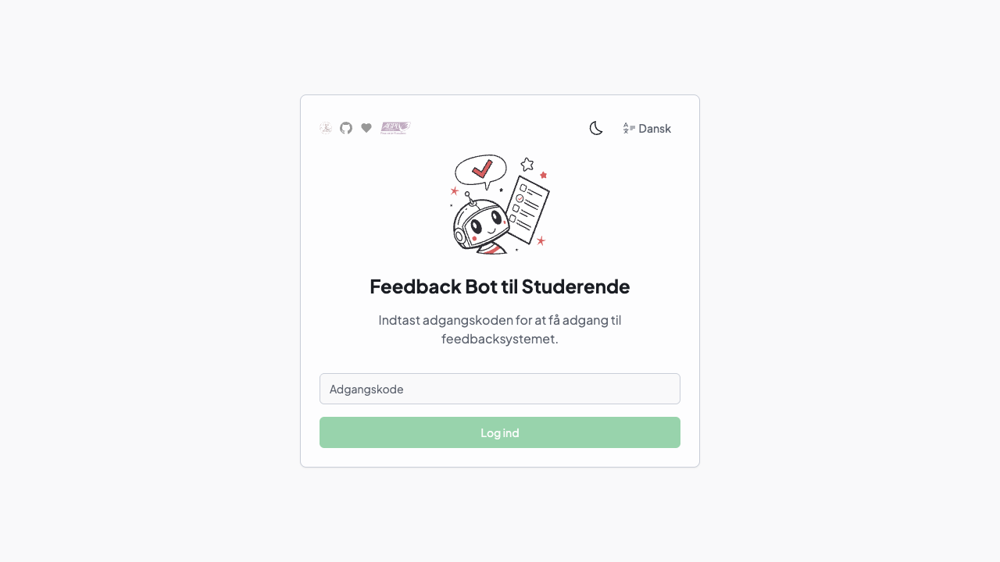](public/screenshots/fullsize/01-password-gate-light.png) | [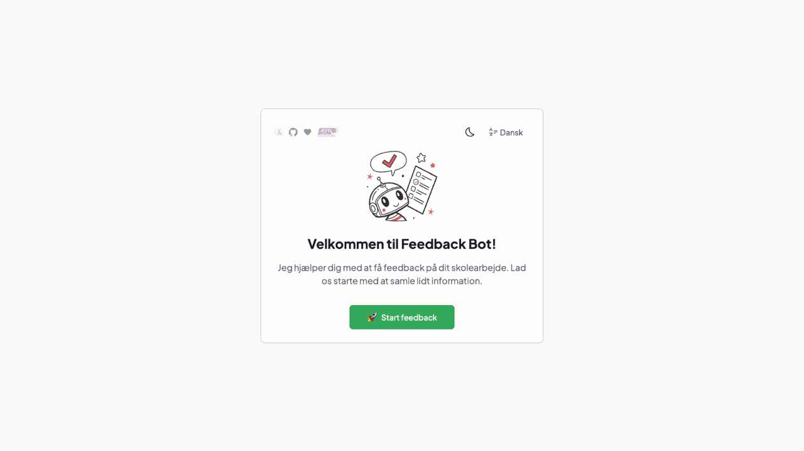](public/screenshots/fullsize/02-welcome-light.png) |

|                       Vælg fag og klassetrin                        |                         Beskriv opgaven                          |
| :-----------------------------------------------------------------: | :--------------------------------------------------------------: |
| [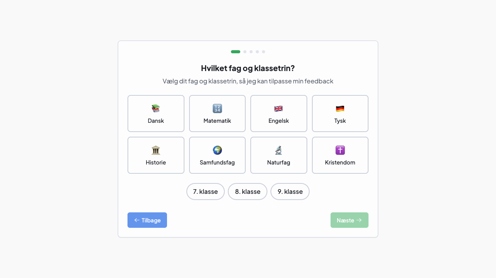](public/screenshots/fullsize/03-subject-grade-light.png) | [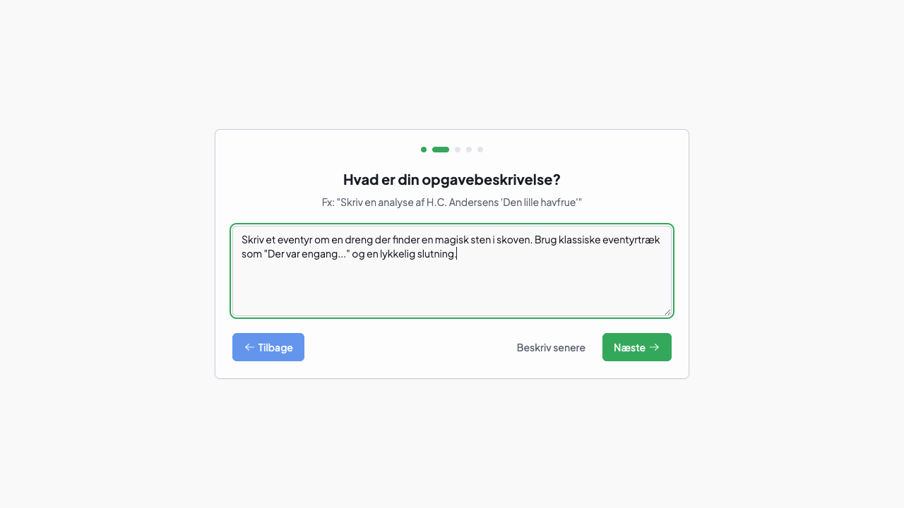](public/screenshots/fullsize/04-assignment-light.png) |

|                      Indsæt dit arbejde                      |                           Karaktervurdering?                            |
| :----------------------------------------------------------: | :---------------------------------------------------------------------: |
| [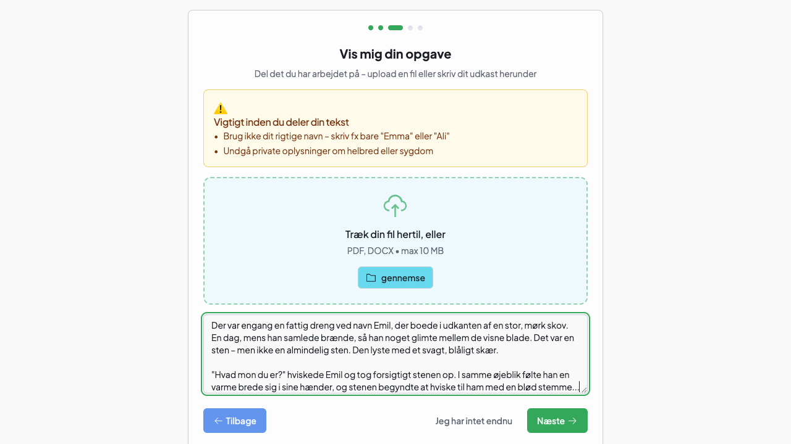](public/screenshots/fullsize/05-student-work-light.png) | [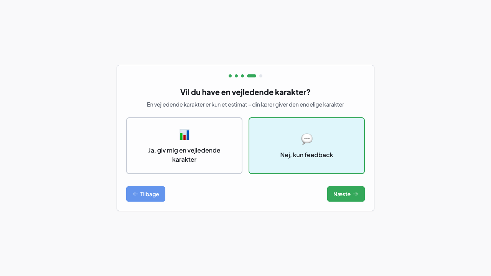](public/screenshots/fullsize/06-grade-preference-light.png) |

|                         Vælg AI-model                         |               Chat med feedback-botten               |
| :-----------------------------------------------------------: | :--------------------------------------------------: |
| [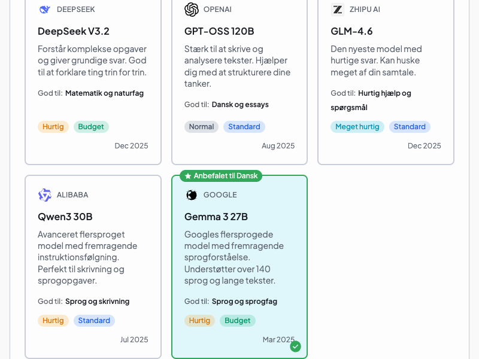](public/screenshots/fullsize/07-model-selection-light.png) | [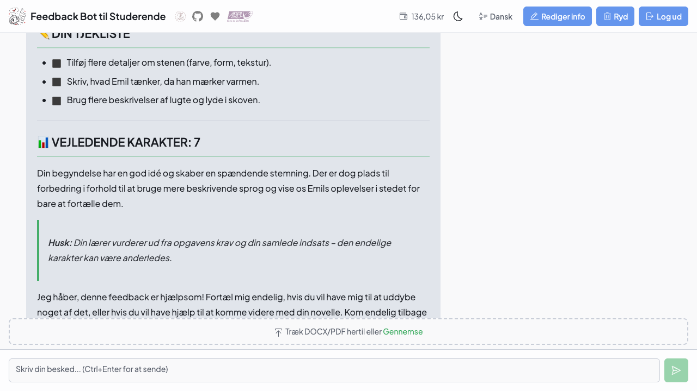](public/screenshots/fullsize/08-chat-window-light.png) |

</details>

<details>

<summary>🌙 Mørk tilstand</summary>

|                         Adgangskode                          |                      Velkomst                       |
| :----------------------------------------------------------: | :-------------------------------------------------: |
| [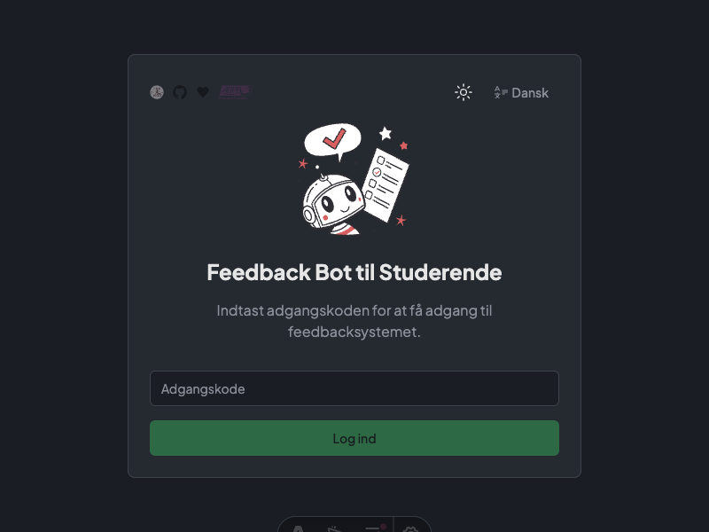](public/screenshots/fullsize/01-password-gate-dark.png) | [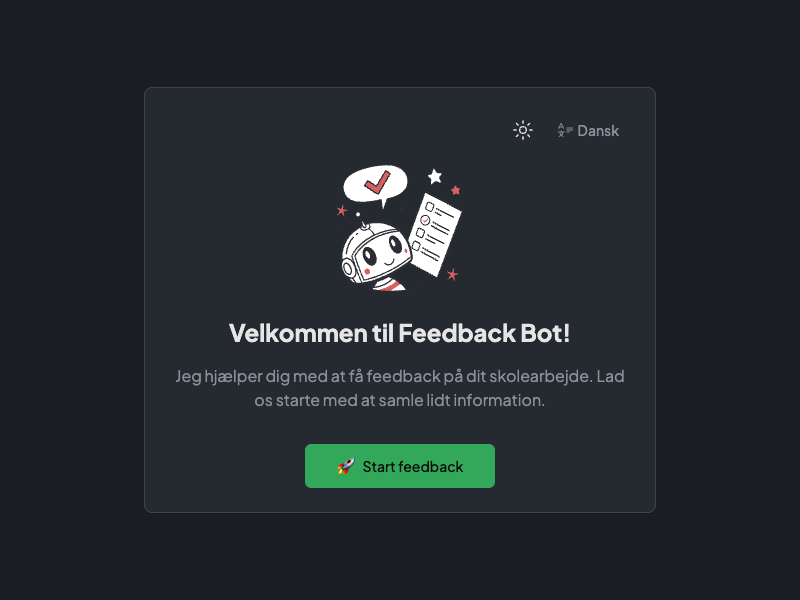](public/screenshots/fullsize/02-welcome-dark.png) |

|                       Vælg fag og klassetrin                       |                         Beskriv opgaven                         |
| :----------------------------------------------------------------: | :-------------------------------------------------------------: |
| [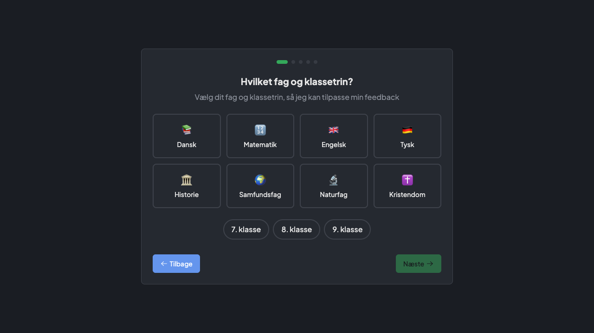](public/screenshots/fullsize/03-subject-grade-dark.png) | [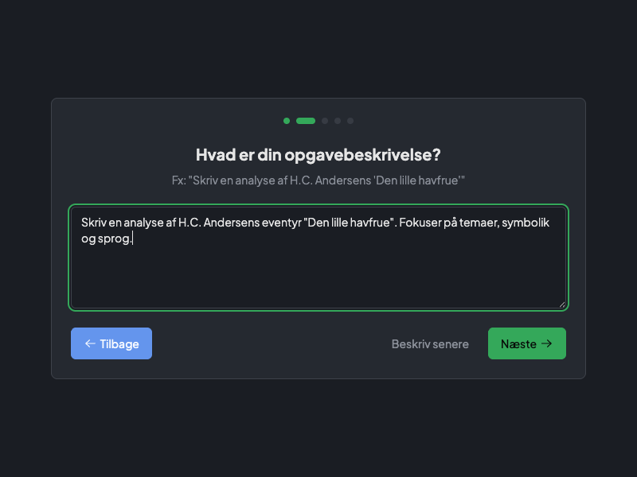](public/screenshots/fullsize/04-assignment-dark.png) |

|                     Indsæt dit arbejde                      |                           Karaktervurdering?                           |
| :---------------------------------------------------------: | :--------------------------------------------------------------------: |
| [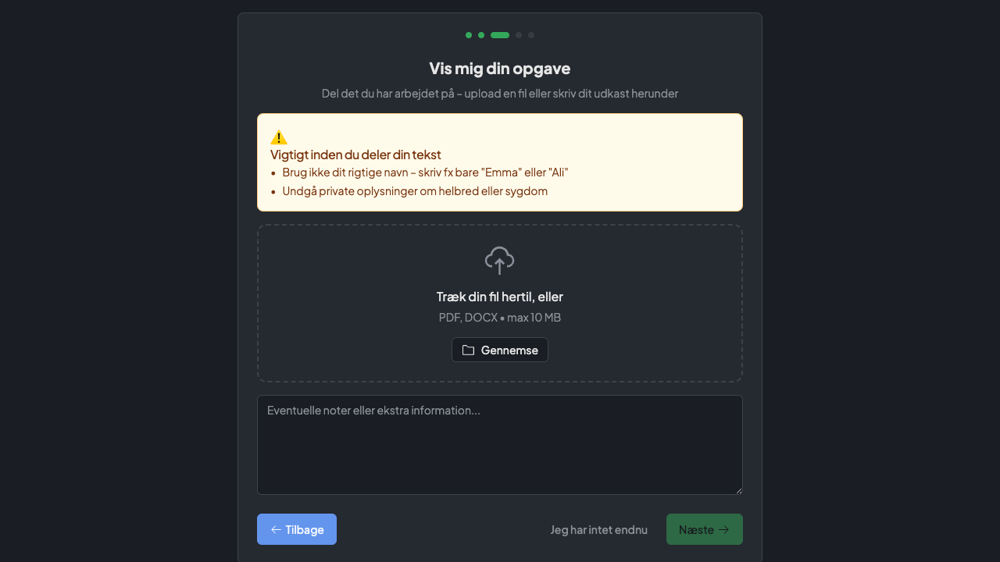](public/screenshots/fullsize/05-student-work-dark.png) | [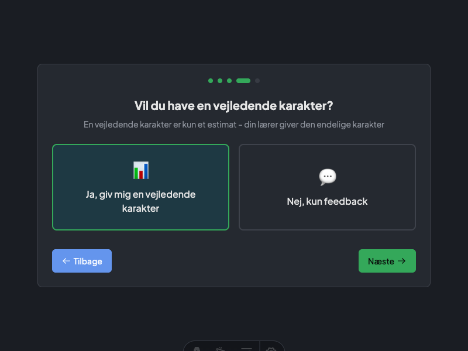](public/screenshots/fullsize/06-grade-preference-dark.png) |

|                        Vælg AI-model                         |              Chat med feedback-botten               |
| :----------------------------------------------------------: | :-------------------------------------------------: |
| [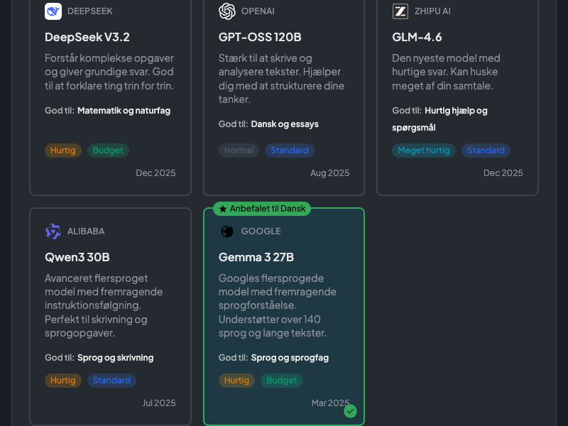](public/screenshots/fullsize/07-model-selection-dark.png) | [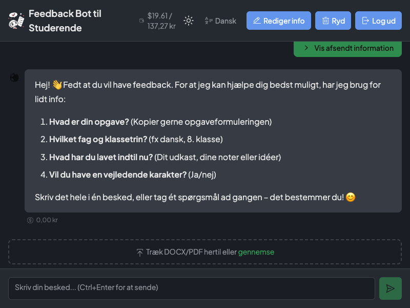](public/screenshots/fullsize/08-chat-window-dark.png) |

</details>

## Udvikling

```bash
bun run dev      # Udviklingsserver
bun run build    # Produktionsbuild
```
